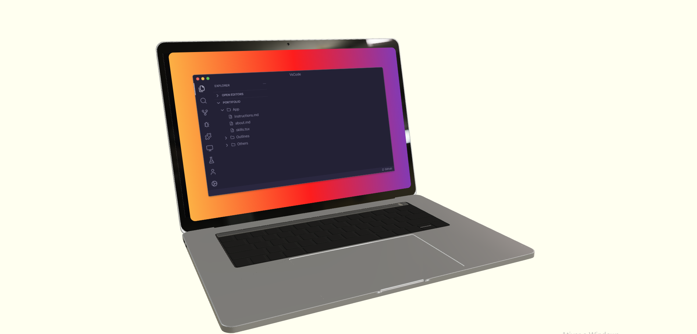

## Portifolio

Essa é a página principal do meu portifolio feito com react e three.js.
Na página você encontra um modelo 3D de um macbook onde dentro da sua tela tem uma página de um vscode, é totalmente interativo tanto o modelo 3D quanto o vscode, cada pasta no vscode conta um pouco sobre mim.
Para acessar a página somente do vscode é só clicar <a href="portifolio-page-beige.vercel.app">aqui</a>
Para acessar o repo do vscode é so clicar <a href="https://github.com/juliuscaezarff/portifolio-page">aqui</a>
Vale ressaltar que você deve abrir a página somente no desktop, não tem versão mobile.

## Libs

- react drei
- react fiber
- three
- vite
- typescript
- <a href="https://market.pmnd.rs/">link</a> para o site do modelo 3D

## Preview
